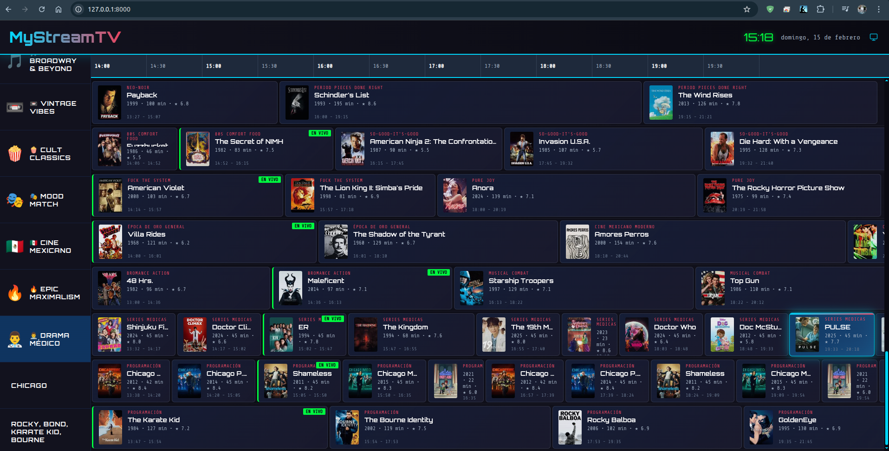
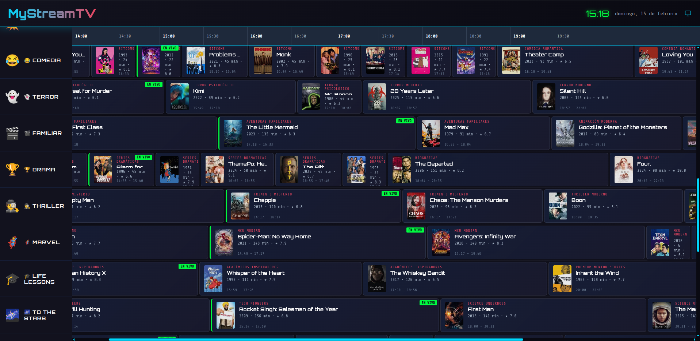
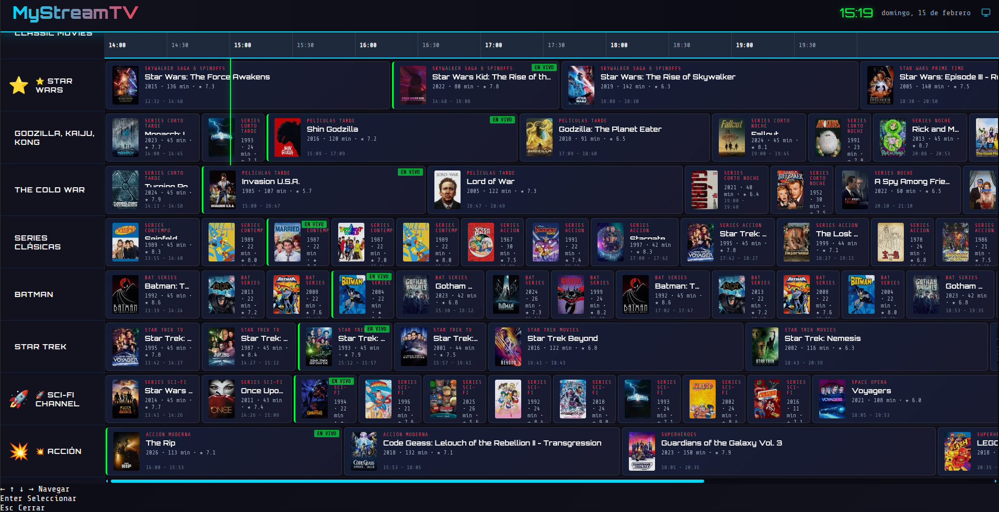
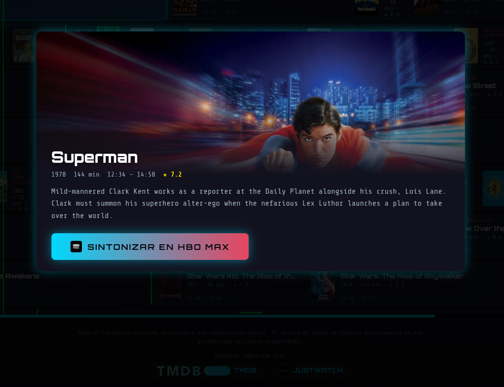
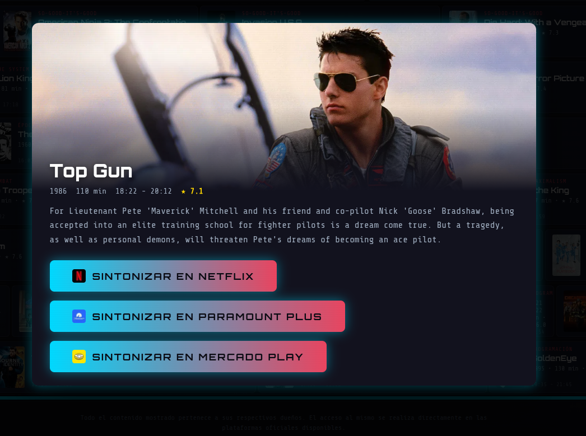
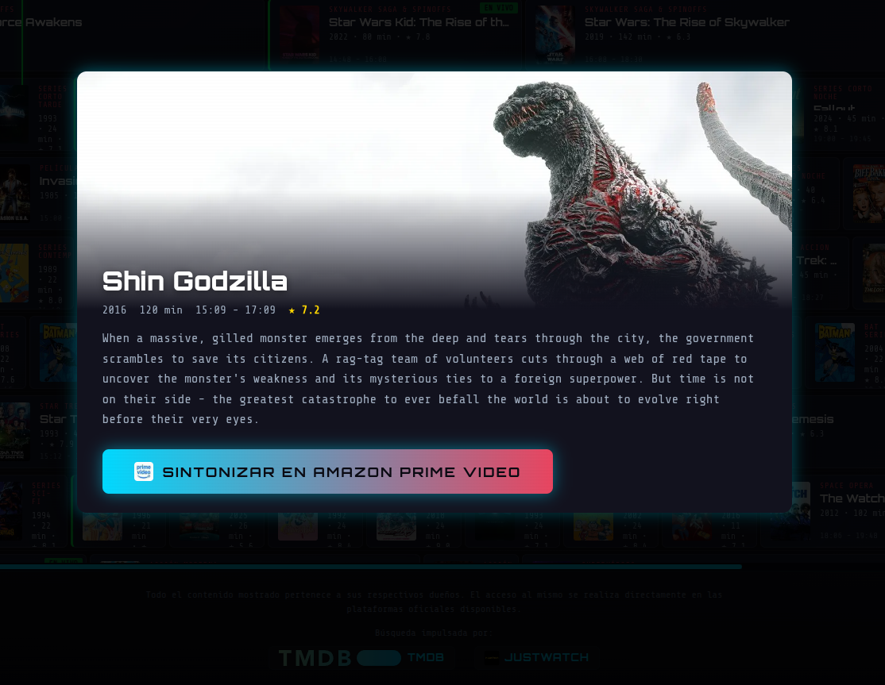
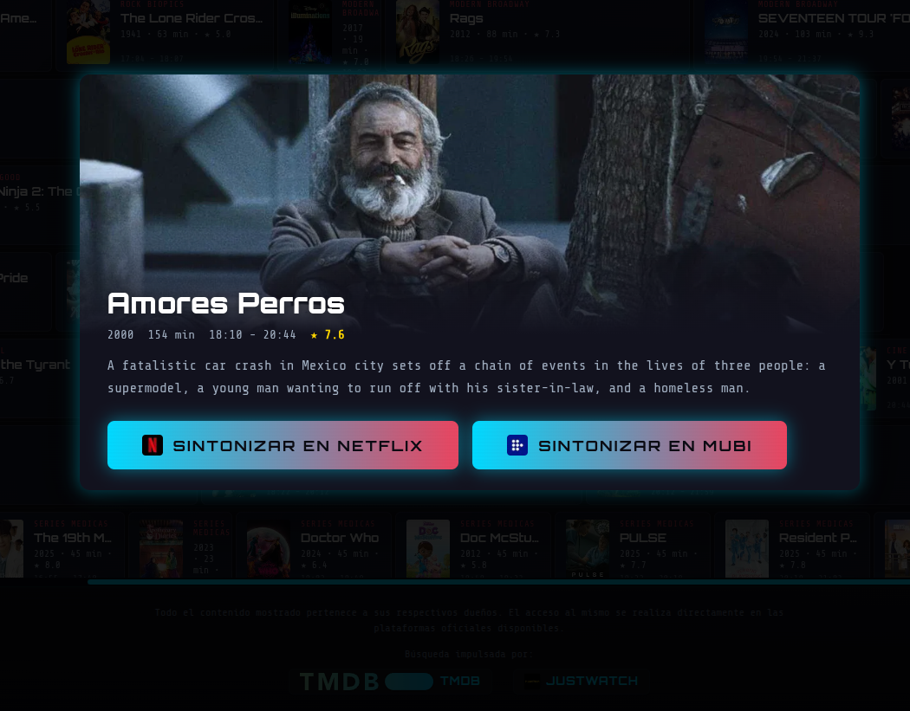
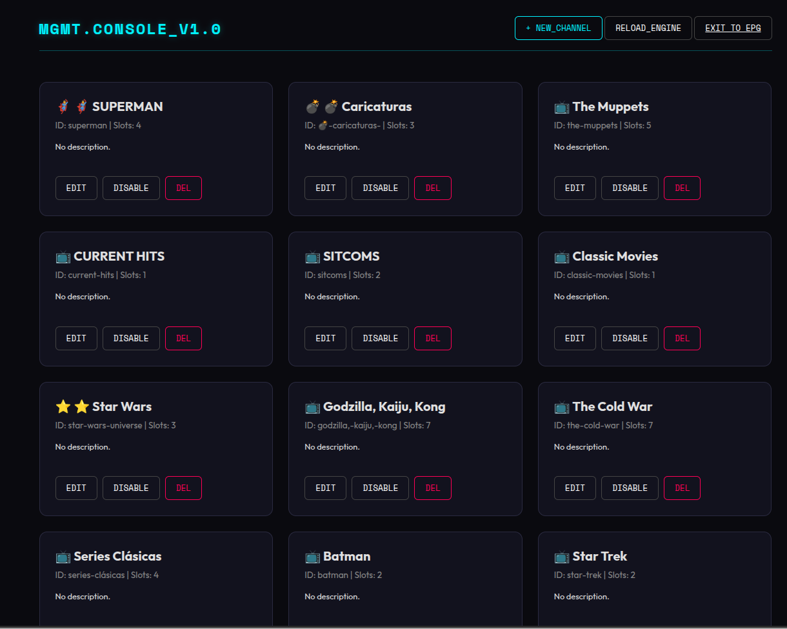
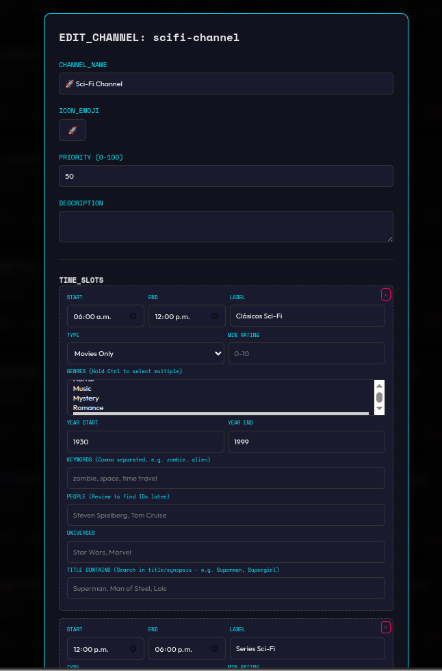
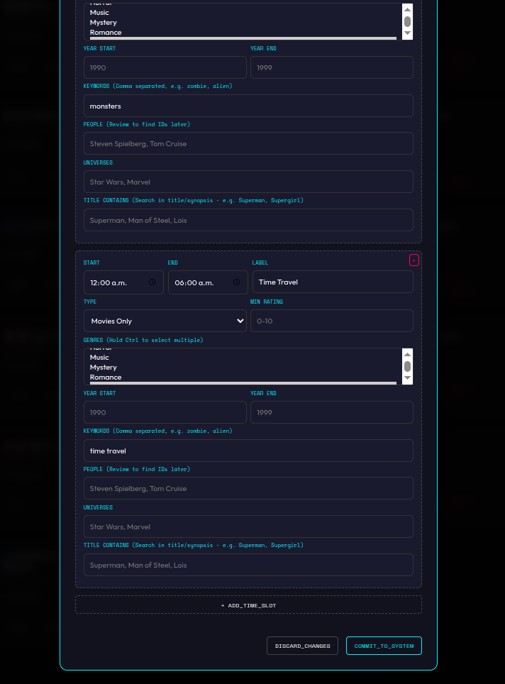

# 📺 MyStreamTV: Tu Guía de Canales Personalizada

MyStreamTV transforma tus plataformas de streaming en una experiencia de televisión tradicional. Crea una Guía de Programación Electrónica (EPG) con canales temáticos personalizados que seleccionan automáticamente contenido de tus servicios favoritos (Netflix, Disney+, HBO Max, Prime Video, etc.).

---

## 🎯 ¿Qué es MyStreamTV?

¿Cansado de pasar 30 minutos eligiendo qué ver? MyStreamTV lo hace por ti. El sistema organiza el catálogo de las plataformas en canales temáticos como "🚀 Sci-Fi", "🎭 Drama Médico" o "🎬 Cine de los 80s", con una programación continua las 24 horas del día.

## 📸 Previsualización

### Guía de Programación (EPG)








---

### Fichas de Contenido y Sintonización

Al seleccionar cualquier programa, se despliega una ficha detallada con la sinopsis y los botones de sintonización directa a las plataformas donde está disponible el contenido.









---

### Panel de Administración







---


## ✨ Características Principales

### 📺 Experiencia de TV Real
- **Canales Temáticos Ilimitados**: Configura canales por género, década, palabras clave o franquicias.
- **EPG Multi-Canal**: Visualiza toda la programación en una interfaz fluida y moderna.
- **Sintonización Directa**: Haz clic en cualquier programa para abrirlo directamente en la plataforma de streaming correspondiente.

### 🧠 Motor de Programación Inteligente (v2.0)
- **Deduplicación de Contenido**: El mismo contenido no aparecerá en dos canales al mismo tiempo.
- **Sistema de Cooldown (7 días)**: Las películas no se repiten en el mismo canal durante una semana (las series están exentas para permitir maratones).
- **Actualización Optimizada**: Al editar un canal, solo se regenera el "pool" de ese canal específico, ahorrando tiempo y peticiones API.

### 🛠️ Herramientas de Administración
- **Panel de Control Web**: Gestiona tus canales, slots de tiempo y filtros sin tocar código.
- **Filtros Avanzados**: Configura slots por nota mínima, actores, directores, idiomas o "universos" (ej. Marvel, Star Wars).

---

## 🚀 Inicio Rápido

### Requisitos Previos
- **Python 3.10+**
- **Clave API de TMDB** ([Obtenla aquí](https://www.themoviedb.org/settings/api))

### Instalación y Ejecución

1. **Clona el repositorio**:
   ```bash
   git clone https://github.com/tu-usuario/mystreamtv.git
   cd mystreamtv
   ```

2. **Prepara el entorno (Linux/macOS)**:
   ```bash
   ./start_server.sh
   ```
   *(El script creará el entorno virtual e instalará las dependencias automáticamente la primera vez).*

3. **Configura tu API Key**:
   Crea un archivo `secrets.ini` en la raíz del proyecto:
   ```ini
   [tmdb]
   api_key = TU_API_KEY_AQUÍ
   ```

### Acceso
- **Guía de TV (EPG)**: `http://localhost:8000`
- **Consola de Administración**: `http://localhost:8000/admin.html`

---

## � Próximos Pasos (TO-DO)

- [ ] **Búsqueda por personas**: Implementar la funcionalidad para buscar contenido por actores, directores y otros miembros del equipo (actualmente no disponible).
- [ ] **Filtro por país de producción**: Agregar la capacidad de filtrar el catálogo basándose en el país de origen.
- [ ] **Deep-linking optimizado**: Generar enlaces directos y profundos a las aplicaciones oficiales de streaming (actualmente los enlaces son genéricos o basados en IDs de TMDB).

---

## �📦 Tecnologías y Versiones

Este proyecto utiliza las últimas versiones estables para garantizar rendimiento y seguridad:

- **Backend**: FastAPI 0.109+, Uvicorn 0.27+, Pydantic 2.5+
- **Frontend**: Vanilla JS (ES6+), CSS3 Moderno (Glassmorphism, Flexbox/Grid)
- **Datos**: TMDB API v3

---

## ⚖️ Disclaimer y Atribución

Este proyecto utiliza la API de **The Movie Database (TMDB)** pero no está endosado ni certificado por TMDB.

<p align="center">
  
</p>

- **Metadatos e Imágenes**: Toda la información de películas, series y posters proviene de [TMDB](https://www.themoviedb.org/).
- **Disponibilidad en Streaming**: La información sobre en qué plataformas está disponible el contenido (Netflix, Disney+, etc.) es proporcionada por **JustWatch** a través de la integración oficial en la API de TMDB.

---

## 📝 Licencia

Este proyecto es de código abierto bajo la licencia MIT. Siéntete libre de usarlo, modificarlo y compartirlo para uso personal.

**Última actualización**: Febrero 2026  
**Versión**: 2.1.0-stable
