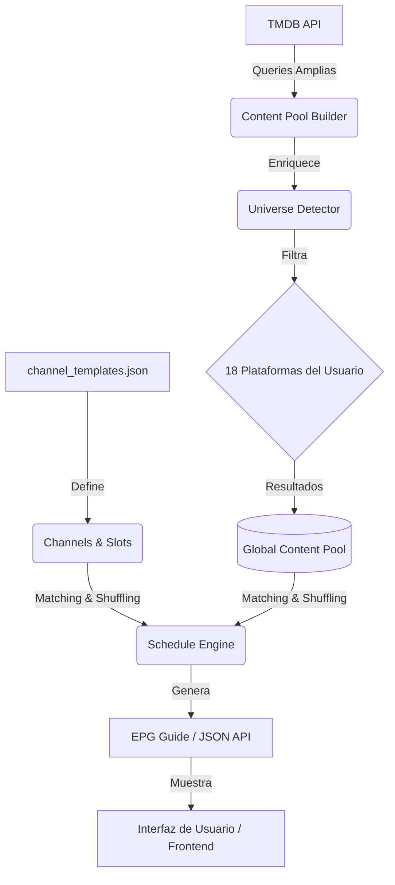

# Arquitectura de MyStreamTV: Canales, Slots y TMDB

Este documento explica el flujo conceptual y funcional detrás de la generación de la guía de programación (EPG) en MyStreamTV.

---

## 1. Creación de Canales y Slots 📅

La estructura de la televisión se define de forma declarativa para permitir una personalización infinita sin cambiar el código base.

### El Archivo de Plantillas (`channel_templates.json`)
Todo comienza en `data/channel_templates.json`. Este archivo es el "master plan" que define qué canales existen y qué transmiten.

*   **Canal (`Channel`)**: Representa una señal temática (ej: "Lunes de Sci-Fi"). Se asocia a un ID y un icono.
*   **Slot de Tiempo (`TimeSlot`)**: Es el bloque fundamental dentro de un canal.
    *   **Horario**: Define `start` (ej: 20:00) y `end` (ej: 22:00).
    *   **Etiqueta (`label`)**: El nombre legible del bloque (ej: "Maratón Intergaláctico").
    *   **Filtros**: El corazón del slot. Aquí se definen los criterios que debe cumplir el contenido:
        *   `genres`: Lista de IDs de género de TMDB (ej: 878 para Sci-Fi).
        *   `universes`: Universos detectados automáticamente (ej: "Star Wars").
        *   `original_language`: Filtro por idioma (ej: "es" para canales latinos).
        *   `decade`: Rango de años (ej: [1970, 1979]).
        *   `vote_average_min`: Calidad mínima (ej: 7.5 para canales "Premium").

### El Modelo de Datos (`models.py`)
El backend carga este JSON y lo convierte en objetos Python (`Channel`, `TimeSlot`). Estos objetos son utilizados por el motor de programación (`ScheduleEngine`) para saber qué buscar.

---

## 2. Población mediante TMDB y Content Pool 🌊

A diferencia de un buscador tradicional que hace una consulta cada vez, MyStreamTV utiliza un sistema de **"Pool Global"** para maximizar la eficiencia y variedad.

### Fase A: Construcción del Pool (`content_pool_builder.py`)
Cuando el servidor inicia, se construye un estanque de contenido:
1.  **Queries de Descubrimiento**: El `PoolBuilder` lanza múltiples peticiones a la API de TMDB basadas en:
    *   Géneros populares.
    *   Idiomas prioritarios (Español/México para canales locales).
    *   Keywords específicas (ej: IDs de Star Wars, Marvel).
2.  **Detección de Universos (`universe_detector.py`)**: Por cada película encontrada, el sistema analiza su metadata (colecciones, keywords, títulos) y le asigna etiquetas como "Marvel", "Star Wars" o "James Bond".
3.  **Validación de Disponibilidad**: Se filtra el contenido para asegurar que esté disponible en alguna de las **18 plataformas configuradas** por el usuario.
4.  **Deduplicación**: Se crea una lista única de ~1000 items (`ContentMetadata`) listos para ser transmitidos.

### Fase B: Llenado de la Parrilla (`schedule_engine.py`)
El motor de programación toma cada slot y realiza los siguientes pasos:

1.  **Filtrado Local**: Del Pool de 1000 items, selecciona solo aquellos que pasan los filtros del `TimeSlot` específico (ej: "Solo películas de Sci-Fi de los 80s con rating > 7").
2.  **Mezcla Determinística**: Utiliza una "semilla" (seed) basada en el ID del canal y la fecha. Esto asegura que:
    *   La programación sea **aleatoria** (para que no siempre veas lo mismo).
    *   Sea **determinística** (si vuelves a cargar la página, la programación es la misma para ese día).
3.  **Encadenamiento de Programas**: Calcula la duración de cada película (runtime) y las va "pegando" una tras otra hasta llenar el bloque de tiempo del slot.
4.  **Generación de Programas (`Program`)**: Crea los objetos finales que el frontend consume, incluyendo horario de inicio, fin, póster y links a las plataformas de streaming.

---

## 3. Criterios Específicos de Asignación (Lógica de Matching) 🧠

La asignación de una película o serie a un slot no es aleatoria; es un proceso de filtrado multi-dimensional donde el contenido debe cumplir con **TODOS** los criterios definidos en la plantilla (lógica AND entre categorías, lógica OR dentro de categorías).

### ¿Cómo se decide si algo entra en un canal?

Cuando el `ScheduleEngine` procesa un slot, evalúa cada item del pool contra estos criterios técnicos (definidos en `ContentMetadata.matches_slot_filters`):

| Criterio | Tipo de Lógica | Descripción |
| :--- | :--- | :--- |
| **Tipo de Contenido** | Match Exacto | Filtra si es `movie` o `tv`. |
| **Géneros** | Intersección (OR) | El contenido debe tener **al menos uno** de los géneros del slot. |
| **Década** | Rango Numérico | El año de lanzamiento debe estar entre el inicio y fin de la década (ej: 1980-1989). |
| **Calificación (Rating)** | Mayor o Igual | El `vote_average` de TMDB debe ser $\ge$ al mínimo pedido (ej: $\ge$ 7.5). |
| **Universos** | Etiqueta Exacta | Debe pertenecer a un universo detectado (ej: "Star Wars" o "Marvel"). |
| **Keywords** | Coincidencia Parcial | Busca palabras clave en la metadata. Si la keyword del slot es "robot", coincidirá con "robots", "robotics", etc. |
| **Blacklist** | Exclusión | Si el contenido tiene alguna keyword de la lista `exclude_keywords`, queda fuera (ej: excluir "terror" en un canal familiar). |
| **Idioma Original** | Match Exacto | Compara el código ISO (ej: `es`, `en`, `fr`). Crucial para canales temáticos extranjeros. |
| **País de Origen** | Membresía | Verifica si el país (ej: `MX`) está en la lista de países de producción. |
| **Gente (Director)** | ID Exacto | Filtra por el ID de TMDB del director (usado en canales de "Ciclos de Director"). |

### El Proceso de Selección

1.  **Filtrado Estricto**: Se descartan todos los items que no cumplan el 100% de los criterios anteriores.
2.  **Sorteo Determinístico**: De los finalistas, se elige usando un algoritmo de "Shuffle" (mezcla) alimentado por una `seed` compuesta por `(Canal_ID + Fecha)`.
    *   *Resultado*: Si hoy a las 8 PM hay 5 películas que califican para "Sci-Fi 80s", el sistema elegirá una. Si recargas la página, elegirá la **misma**, pero mañana la selección será **distinta**.
3.  **Ajuste de Tiempo**: Si la película elegida es muy larga y se sale demasiado del bloque, el sistema busca la siguiente en la lista mezclada que encaje mejor.

---

## Resumen del Flujo 🔄

